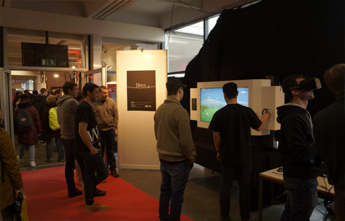

# Birds - An interactive, chirping media installation
## Summary
The goal of this project was to create an artistic and engaging media installation. We built a wooden frame for the installation and added a screen to it.
This screen offers a view into a computer graphic world: It displays a bright and colorful polygon landscape with mountains, trees, a river and a rope in front of the scenery.  
Usually, polygon birds fly in a flocking behavior in the background, implemented with rules as described by <a href="http://www.red3d.com/cwr/index.html" target="_blank">Craig Reynolds</a>.
However, the birds are attracted by the rope placed in front of the scenery. Therefore, they like to land on it and enjoy the view into our real world. As the birds are programmed as
autonomous agents, nobody does exactly know what they will do next. Occasionally, they even wave to the users or scratch their heads. For the interaction between the users and the birds,
we added a camera with a microphone and a crank to our installation. The wide-angle camera captures the user's movements and the microphone the current noise level so that the birds are scared if the users are too loud or move too fast. This way, the users have to be careful when approaching the adorable birds. Furthermore, users can spin the crank to stretch or release the rope the birds are sitting on.

## Achievements
* We presented the project at an open day at our university.
* The project was hung up in the university building for future generations of students.

## My responsibilities
* Creating interactions with the user (audio and crank)
* Coding the interface to fear the birds
* Working on the concept and parts of the hardware
* Implementing small scripts for the scene and agents

## Media
**[Video: Birds Media Installation](https://www.youtube.com/embed/Tuy0Cl3ZDKM)**

**Installation with sign on the side explaining it**

**Showing our installation at an open day**

**Using the crank to move the cord**

**Joyfull visual and auditive interaction with the adorable birds**

**User happily teasing the poor birds by clapping**

**Poor bird on the right trying to hide**

**Brave bird waving to the user**

**User carefully approaching a lonely bird**

**Teammates working on the frame in the wood workshop**

**Adding hardware to the frame**

