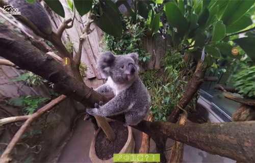
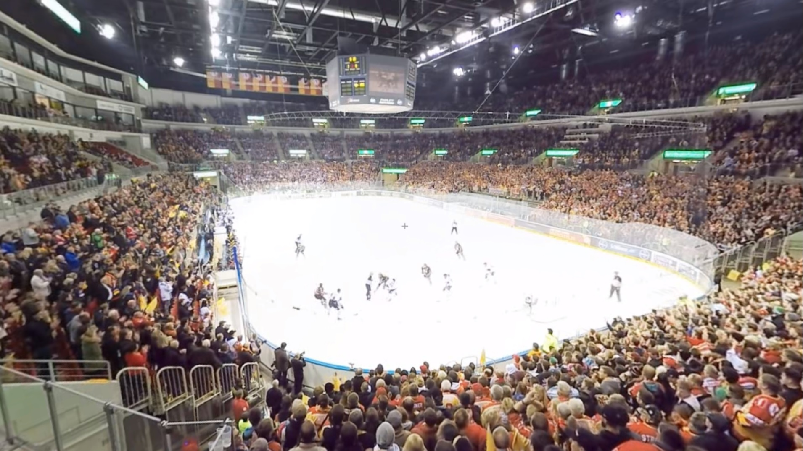

# Immersive 360° Videos - Virtual Reality Zoo Visit and Immersive Journalism
## Summary
The core of this project comprised the production and processing of interactive 360&#176; videos. The challenges involved included
recording, stitching and interactions within 360&#176; videos. First, we did research 360&#176; videos, possible applications and interaction concepts.
The goal was to immerse the user into the 360&#176; world by using a Head-Mounted Display (<a href="https://www.oculus.com/en-us/dk2/" target="_blank">Oculus Rift DK2</a>) and high-resolution 4K video footage from <a href="https://gopro.com/" target="_blank">GoPro cameras</a>. Through cooperation with the <a href="http://www.zoo-duisburg.de/" target="_blank">Duisburger Zoo</a>, one of the most visited zoological gardens in Germany with approximately one million visitors per year, we had the chance to record 360&#176; videos from different perspectives in diverse animal enclosures. The user can operate multiple control elements placed in the virtual world to change perspectives, watch 2D documentaries with the zookeepers or open information boxes about the animals.

Besides the zoo application, we explored how journalism could be immersively experienced by the user. We recorded an ice hockey game between two rival german teams, so the user could experience the game and atmosphere first hand. In addition, the user could watch a 2D documentary about the ice hockey training and get information about his favorite players. The immersive journalism part of the project was conducted in cooperation with the <a href="http://www.rp-online.de/" target="_blank">Rheinische Post</a>, a newspaper which gets read by 22.4% of the german population in its distribution area.

## Achievements
* The <a href="http://www.zoo-duisburg.de/" target="_blank">Duisburger Zoo</a>, one of the most
visited zoological gardens in Germany with approximately one million visitors per year, was very happy about our result. They featured our app on their website.
* We presented our work at an in-house exhibition with 250 participants.
* We presented our work to the CEOs of the <a href="http://www.rp-online.de/" target="_blank">Rheinische Post</a> (a newspaper which gets read by 22.4% of the german population in its distribution area), who were amazed by our results, opening the door to further project collaborations.

## My responsibilities
* Specifying and deciding on technical requirements, e.g. video codecs and platforms. 
* Coding UI interactions, e.g. opening / closing buttons, images, and videos. This was done from the ground up in [Unity3D](https://unity3d.com). 
* Recording of 360° videos in the zoo with GoPro cameras. For this purpose, we bought a ready-to-use 3D-printed camera rig which provided a mount for six GoPros.
* Stitching some of our 360° zoo videos with an off-the-shelf video stitching software. Back then, there was still quite some configuration work to be done though.

## Media
**[Video: 360° Video Project VR - Immersive Journalism](https://www.youtube.com/embed/4a9hLdh53QQ)**

**User exploring an animal enclosure**

**Being at close range with a koala**

**Experiencing a dolphin show from unique perspectives**

**Observating cute bears**

**Watching 2D documentaries in the 360° world**

**Standing on the field during an ice hockey opening ceremony**

**Experiencing an ice hockey game from close range**

**Cheering with the crowd - Feeling the atmosphere on the terrace first hand**

**Getting exceptional insights after the game**

**Displaying information about the user's favourite players**

[**Back to the top**](#summary)

[**Back to Portfolio**](https://github.com/bromanz/Portfolio#project-pages)
