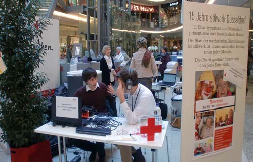
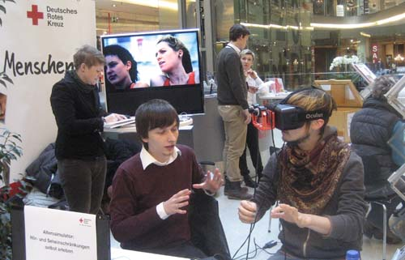
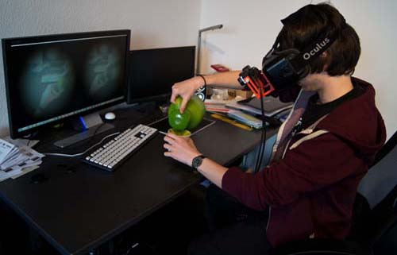
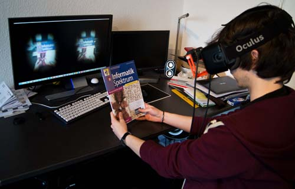
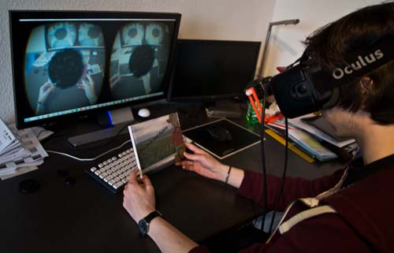
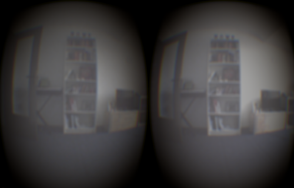

# Diminished Human - Empathizing Audiovisual Sense Impairments with Mixed Reality
## Summary
This project addresses the challenge of empathizing with audiovisual sense impairments, e.g. in the case of elderly people or people with special needs. The developed system aims at providing users with the experience of diminished sight and hearing. We designed a system that can simulate several disease patterns, focusing on but not limited to limitations experienced by older people. The system incorporates real-time usage of visual and auditory filters on the user’s actual perception by combining two cameras with a head-mounted display for stereoscopic view and a pair of microphones with equalized headphones for spatial hearing.

## Achievements
* Tested the system informally with experts and non-expert users. They qualified it as useful for enhancing the empathy for audiovisual sense impairments, motivating a further development of this idea.
* Presented in a local mall in Duesseldorf in cooperation with the <a href="https://www.drk.de/en/" target="_blank">Deutsches Rotes Kreuz</a>, which is part of the <a href="https://en.wikipedia.org/wiki/International_Federation_of_Red_Cross_and_Red_Crescent_Societies" target="_blank">International Federation of Red Cross and Red Crescent Societies</a>, the biggest humanitarian organization in the world.
* [Raised few interests in public media](#further-information).
* One of the first projects to modify a modern HMD with external cameras.
* Project was published in <a href="http://dl.acm.org/citation.cfm?id=2875226" target="_blank">Proceedings of the 7th Augmented Human International Conference 2016</a> (sponsored by Google) as one out of 21 selected full papers in 138 submissions (Paper Acceptance Rate: 15%).

## My responsibilities
* I did this work as part of my bachelor thesis, so basically everything except the audio part in the paper (I used a different audio system in my thesis).

## Further information
<ul>
	<li><a href="http://www.augmented-human.com/" target="_blank">&#8594; (Website): Augmented Human Conference</a></li>
	<li><a href="http://dl.acm.org/citation.cfm?id=2875226" target="_blank">&#8594; (ACM Digital Library): Augmented Human 2016 International Conference – Empathizing audiovisual sense impairments – Interactive real-time illustration of diminished sense perception</a></li>
	<li><a href="http://medien.hs-duesseldorf.de/personen/geiger/alterssimulation" target="_blank">&#8594; (German Website): HS Düsseldorf – Wie fühlt man sich im Alter?</a></li>
	<li><a href="http://www.derwesten.de/nrz/staedte/duesseldorf/so-fuehlt-man-sich-im-alter-aimp-id10307382.html" target="_blank">&#8594; (German Newspaper): Der Westen – Wie fühlt man sich im Alter?</a></li>
</ul>

## Media
**Showing the prototype in public with the DRK**

**Testing different sense impairments with the users**

**Trying to drink tea with diminished sight**

**Experiment to empathize with visual impairments**

**Experiencing macula degeneration while reading**

**First person perspective of visual impairments**

[**Back to the top**](#summary)
