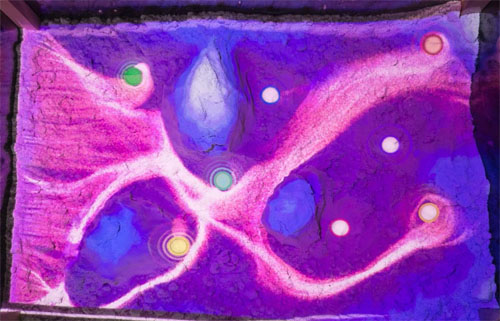
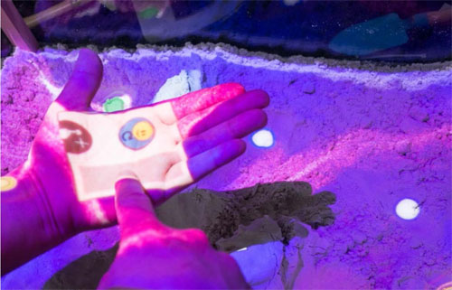
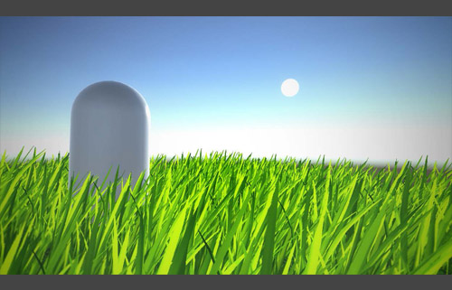
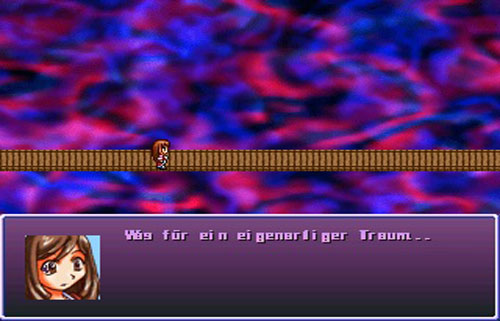

# Others (free time, or smaller ones)
## Smartcity - Augmented Reality Visualization
* Programmed an Augmented Reality visualization for 1 month in a team of 4 for Panasonic. Coded on the user interaction and animation sequences.
* Project featured at the <a href="http://www.ifa-berlin.de/en/" target="_blank">IFA 2016 in Berlin</a> (world's leading trade show for consumer electronics and home appliances).

**Panasonic smartcity AR booth**

## Augmented Reality photo album
* My vision was to breathe life into my old photos. An Android app enables the user to see different animations or effects on the images, e.g. it is snowing on a winter image or you can see the people breathing.

**Magic lens exposes my bad barbecue skills**

## Augmented Reality Sound Sandbox: An artistic installation for musical expression
This installation produces ambient soundscapes using a Lattice Boltzmann based particle simulation running through a deformable landscape.
Our interface exploits the three-dimensional topology of physical sand, distributed over a tabletop surface. Visual feedback is front-projected onto the sand and onto the users
hand. The user can explore the landscape by using his or her hands and use spatial gestures via on-body projection to control AR content and further settings.

Although the project itself was a huge effort, it was mainly conducted by Bastian Dewitz as part of his master thesis. However,
I helped him out with prototypes, visuals, interaction design, camera to projection space calibration and an informal evaluation.

The project was published in <a href="https://link.springer.com/chapter/10.1007/978-3-319-73062-2_5" target="_blank">INTETAIN 2017: Intelligent Technologies for Interactive Entertainment</a>

**[Video: Augmented Reality Sound Sandbox](https://www.youtube.com/embed/H0eqN31qsjY)**

**Particles flowing over the sand**

**Control menu projected on the user's hand**

## Lecture: Real-Time Rendering
The goal was to develop a shader and a corresponding ray tracing implementation. I implemented a grass shader with billboards using Unity3D, ShaderLab/CG/HLSL and ray tracing program using <a href="https://developer.nvidia.com/optix">NVIDIA OptiX</a>. Compared both results in a short report.

**Grass billboard shader with animation in Unity3D**

## LeapMotion - Rock Paper Scissors - Proof of Concept
Coded small Proof of concept when the first version of LeapMotion was released in 2013.

**[Video: LeapMotion - Rock Paper Scissors - Proof of Concept](https://www.youtube.com/embed/I8YFMh3L_GA)**

## Java Robot programming - Race IT
We built and programmed a robot driving in a circuit with <a href="http://www.lejos.org/nxj.php" target="_blank">LeJOS, Java for Lego Mindstorms</a>. It had light, ultrasonic and RFID sensors to recognize the route, distances to obstacles and the type of obstacles it had to overcome. I programmed the ultrasonic sensor, the algorithm to drive over a seesaw, and our scanning and planning algorithm.

**[Video: Java Robot programming - Race IT](https://www.youtube.com/embed/H7a-Dd6fPmQ)**

## Sudoku with Java
In our second semester, we implemented Sudoku on the command prompt with Java. The biggest challenge was to make the game easy to play via the command prompt. I coded the user interaction.

**[Video: Sudoku with Java](https://www.youtube.com/embed/S0vJuI4LfUM)**

			

## Mini RPG-Game
Created for a friend using RPG-Maker 2k.

**Waking up in a foreign room, without any memories**

**Such a weird dream...**

**Underworld: On the way to the demon king**

## Blitzbasic Projects
Actually, Blitzbasic got me into programming at the age of around 10-13, I can't recall exactly. I started programming because I was a little gamer and I was always wondering how it is possible to create video games. However, this project was about practicing easy linear functions in the form f(x)=ax+b and one of my first programming projects ever. Some younger friends used this program to practice for their exams - needless to say they did well hehe.

**Practice linear functions with math text problems, calculation of intersection points, amongst other things**

**Giving rough graphical representations of linear functions**

## Autodesk Maya shorts
We created two short movies with Maya:
<ol>
	<li>The goal of the first one was to capture the atmosphere of a graveyard scenery.</li>
	<li>The goal of the second one was to show an abstract chain reaction between multiple objects.</li>
</ol>

**[Video: Maya Graveyard scene](https://www.youtube.com/embed/j-n6WaSx484)**

**[Video: Maya Chain reaction short](https://www.youtube.com/embed/hgzCMNz6FXc)**

## Others
(will add them when I'm finding the footage and also time for it)
* Android Quiz App programmed with <a href="https://www.ludei.com/cocoonjs/" target="_blank">CocoonJS</a>
* Web pong (HTML, CSS, JS)
* UnrealTournament map I created (UnrealEditor)

[**Back to the top**](#summary)