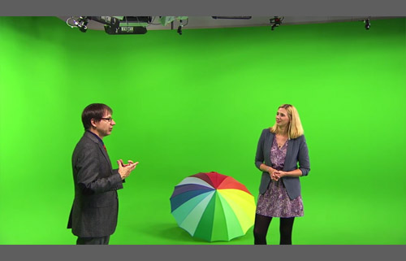
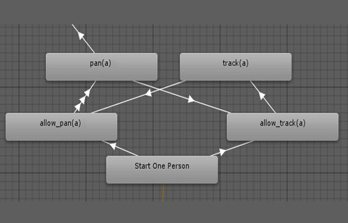
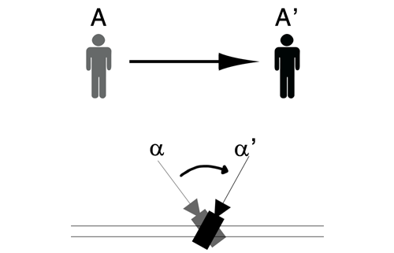

# Virtual Studio - Semi-Automatic Camera and Switcher Control
## Summary
Live video broadcasting requires a multitude of professional expertise to enable multi-camera productions. Robotic systems allow the automation of common and repeated tracking
shots. However, predefined camera shots do not allow quick adjustments when required due to unpredictable events. We introduce a modular automated robotic camera
control and video switch system, based on fundamental cinematographic rules. The actors’ positions are provided by a markerless tracking system. In addition, sound levels of
actors’ lavalier microphones are used to analyze the current scene. An expert system determines appropriate camera angles and decides when to switch from one camera to another.
A test production was conducted to observe the developed prototype in a live broadcast scenario and served as a video demonstration for an evaluation.

## Achievements
* Project was published in <a href="http://dl.acm.org/citation.cfm?id=2933559&CFID=809433705&CFTOKEN=92497163" target="_blank">Proceedings of the ACM International Conference on Interactive Experiences for TV and Online Video 2016</a>
 (sponsored by Samsung) as one out of 44 selected contributions in 168 submissions (Overall Acceptance Rate: 26%).
* German version also published in Fernseh- und Kinotechnische Gesellschaft e.V. magazine: <a href="https://www.fktg.org/halbautomatische-steuerung-von-kamera-und-bildmischer-bei-live-uebertragungen" target="_blank">Halbautomatische Steuerung von Kamera und Bildmischer bei Live-Übertragungen</a>

## My responsibilities
* Building the expert system with state machines
* Coding interfaces to the switcher and camera control modules
* Implementing the audio recognition via lavalier microphones

## Media
**Host explaining camera modules**

**Test production with two persons**

**Hierarchical state machine of the system**

**Pan camera module for one person**

