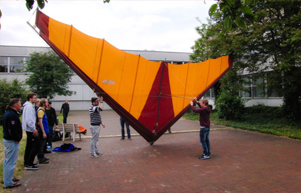
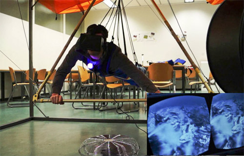
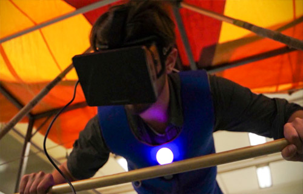

# Zero Gravity - A Virtual Reality experience in air and water
## Summary
The goal of this project was to fulfill the dream of flying in Virtual Reality. For this purpose, we bought a hang glider and constructed a scaffold for it. With that construction, the user could get into the hang glider, lie in the air and control it like he would do in a real flying scenario. Tracking of his motions allowed the transfer of his controls into the virtual world.
We used a Head-Mounted Display and headphones to immerse the user visually and auditively into the virtual world. In addition, we used multiple wind machines and vibration feedback controlled by events in the scene to provide realistic haptic feedback, e.g. a high flying speed results in high wind intensities.

In the second part of this project, we added an underwater scene to the virtual world. This way, the user could fly around an island, until he crashed into the sea, transitioning to the
underwater world. There he could explore the bottom of the ocean in a submarine.

## Achievements
* To our knowledge, it was the first VR flying application with wind feedback and a modern HMD
* Project was published in <a href="http://dl.mensch-und-computer.de/handle/123456789/3909" target="_blank">Mensch & Computer 2014 - Workshopband</a>.
With over 800 participants in the last years, the Mensch & Computer is one of the biggest Human-Computer-Interaction conferences all over Europe.

## My responsibilities
* Construction and implementation of a vibration vest. We built it out of the components of the "Marvel Avengers Vybe Haptic Video Game Chair Pad". It is made out of several vibration units (I believe six) which are controlled by the outgoing sound of applications. But we still wanted to have normal sound for the user with no correlation to vibrations. So we splitted the outgoing audio signals in different channels to distinguish between real audio for the user and basically sine waves we produced to accurately control vibrations. The different units reacted depending on the frequency, amplitude, and stereo shifts, so we built a small library for vibration control from scratch.
* Coding the control of the wind machines. We achieved this by plugging the wind machines into a DMX dimmer which in turn was connected to a work station. It received control information via COM-port from our [PureData](https://puredata.info/) application, which in turn got its intensity signals for four wind machines from our [Unity](https://unity3d.com) application via [OSC protocol](https://puredata.info/).
* Optimizing the scene (Unity specifics like Occlusion culling, Frustum culling, Level of detail, Light baking, ...)
* Implementing small interaction scripts

## Media
**[Video: ZeroGravity](https://www.youtube.com/embed/mPqKV0Y3_uk)**

)

**First time setup of the hangglider**

**User flying down a mountain**

**User enjoying his sight while flying**

[**Back to the top**](#summary)

[**Back to Portfolio**](https://github.com/bromanz/Portfolio#portfolio)
