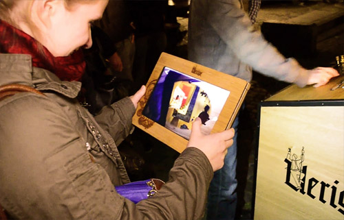

# Public Brewing - A Media Façade with a Mixed Reality Interface to brew beer
## Summary
Public Brewing is an interactive media façade at a local brewpub. The aim of the project was to create an interactive installation that allows people to experience the beer brewing process in an entertaining yet technically correct way. The public interacted with the installation by using a tangible interface, a control desk with buttons, cranks and several gauges. We developed three augmented reality visualizations to investigate the combination of several interaction techniques to provide an expressive and engaging interface to different user groups:
<ol>
	<li>A virtual factory can be
explored by looking into the machine, providing
entertaining content that is directly linked to the interactions
of the machine and main façade. For example, when the user inputs a real coin into the machine to start the brewing process, one can observe a virtual coin rolling into a coin slot, where it is checked by a virtual character.</li>
	<li>A virtual expert avatar
explaining and providing technical detail about the brewing
process when looking at the control elements on the desk of
the machine.</li>
	<li> A message-in-a-bottle application provides
a takeaway experience, showing virtual messages inside
the real beer bottles. The messages consist of well-known
idioms of the brewpub, building a bridge to traditional
elements of the brewery.</li>
</ol>

In addition, a VR application was developed. This application allowed the user to shrink in size and walk around in the brewing machine among the dwarfs.

## Achievements
* Various appearances in local newspapers and presentations on conferences (e.g. <a href="http://www.cebit.de/home">CeBIT</a> 2015, the largest and most internationally represented computer expo)
* Project was also published in <a href="http://dl.acm.org/citation.cfm?id=2757736" target="_blank">Proceedings of the 4th International Symposium on Pervasive Displays</a>.

## My responsibilities
* Creating virtual environment
* Coding animations and effects of dwarfs and other elements
* Programming interface to real-machine inputs and their implications on the virtual world

## [Further information]
<ul>
	<li><a href="http://www.publicbrewing.de" target="_blank">&#8594; (Website): Public Brewing - Main website</a></li>
	<li><a href="http://dl.acm.org/citation.cfm?id=2757736" target="_blank">&#8594; (ACM Digital Library): PerDis'15 - Public Brewing: a Media Façade with a Mixed Reality Interface</a></li>
	<li><a href="https://www.youtube.com/watch?v=hOo-aZ6z5_0" target="_blank">&#8594; (Video): InsideAR Conference</a></li>
	<li><a href="http://www.heise.de/ix/heft/Public-Brewing-2556765.html" target="_blank">&#8594; (German Article): iX - Public Brewing - Interaktive Medienfassaden mit Mixed-Reality-Anwendung</a></li>
	<li>(German News): <a href="http://www.rtl-west.de/beitrag/artikel/neues-alt/" target="_blank">&#8594; RTL</a>, <a href="http://www.rp-online.de/nrw/staedte/duesseldorf/uerige-fassade-wird-interaktives-kino-aid-1.4279708" target="_blank">&#8594; RP Online</a>, <a href="http://www.express.de/duesseldorf/innovativ--verrueckt--eine-riesen-show--public-brewing--in-der-duesseldorfer-altstadt-2932888" target="_blank">&#8594; Express</a>, <a href="http://www.wz.de/lokales/duesseldorf/public-brewing-in-der-brauerei-uerige-1.1653817" target="_blank">&#8594; WZ</a> </li>
</ul>

## Media
**Video: Public Brewing - First AR Extension**

<iframe src="https://www.youtube.com/embed/mPqKV0Y3_uk" allowfullscreen></iframe>

**AR Magic lens provides a look into the brewing machine**

**Real coins put into the machine trigger virtual coins rolling in**

**Bottle goes up an elevator before presented at the same place in the real world**

**Dwarf pushing the bottle over the conveyor belt**

**A secret message for the user is hidden inside the bottle**

**User exploring the virtual factory inside the machine**

