# Portfolio
I created this repository to collect and summarize many of my finished projects. It mainly includes projects I did during my studies or in my free-time (work experience mostly not included, as they require privacy from the companies I've been working for so far). Besides the projects listed here, I also have some public repositories on my GitHub account (mainly experiments, contributions, or work in progress though), but feel free to check them out too if you're interested. Below you will find five categories:
1. [**Papers**](#papers) - Here I put all the links to my published scientific papers and articles 
2. [**Tech blog posts**](#tech-blog-articles) - From time to time I share some collected knowledge about a topic or explain some ideas I had. 
3. [**Talks**](#talks) - Official public talks I've given. 
4. [**Coding-Competitions**](#coding-competitions) - Though not very active in this area right now, I collected my achievements there.
5. [**Project pages**](#project-pages) - These link to more specific project information including a summary, achievements, my responsibilities in these projects, etc.

## Papers
* <a href="https://link.springer.com/chapter/10.1007%2F978-3-319-73062-2_8" target="_blank">Trampoline Jumping with a Head-Mounted Display in Virtual Reality Entertainment</a>
* <a href="https://link.springer.com/chapter/10.1007/978-3-319-73062-2_5" target="_blank">AR Sound Sandbox: A Playful Interface for Musical and Artistic Expression</a>
* <a href="https://dl.acm.org/citation.cfm?id=2933559" target="_blank">Semi-Automatic Camera and Switcher Control for Live Broadcast</a> ; <a href="https://www.fktg.org/halbautomatische-steuerung-von-kamera-und-bildmischer-bei-live-uebertragungen" target="_blank">Halbautomatische Steuerung von Kamera und Bildmischer bei Live-Übertragungen</a>
* <a href="https://dl.acm.org/citation.cfm?id=2875226" target="_blank">Empathizing Audiovisual Sense Impairments: Interactive Real-Time Illustration of Diminished Sense Perception</a>
* <a href="https://dl.acm.org/citation.cfm?id=2757736" target="_blank">Public Brewing: a Media Façade with a Mixed Reality Interface</a>
* <a href="https://dl.gi.de/handle/20.500.12116/8203" target="_blank">ZeroGravity - eine virtuelle Nutzererfahrung in Luft und Wasser</a>
## Tech blog articles
* <a href="https://medium.com/@bromanz/axis-aligned-bounding-tetrahedra-and-octahedra-for-ray-tracing-bounding-volume-hierarchies-683751d84bca" target="_blank">Axis-Aligned Bounding Tetrahedra and Octahedra for Ray Tracing Bounding Volume Hierarchies</a>
* <a href="https://medium.com/@bromanz/another-view-on-the-classic-ray-aabb-intersection-algorithm-for-bvh-traversal-41125138b525" target="_blank">Another View on the Classic Ray-AABB Intersection Algorithm for BVH Traversal</a> (also referenced in the <a href="http://www.realtimerendering.com/intersections.html">Real-Time Rendering Intersection</a> Table)
* <a href="https://medium.com/@bromanz/how-to-create-awesome-accelerators-the-surface-area-heuristic-e14b5dec6160" target="_blank">How to create awesome accelerators: The Surface Area Heuristic</a>
* <a href="https://medium.com/@bromanz/simd-sse-unity3d-net-2-0-70f6c911713f" target="_blank">Utilizing SIMD/SSE in Unity3D (.NET 2.0)</a>
## Talks
* <a href="https://unite.unity.com/de/2018/berlin/autotech" target="_blank">Unite Berlin 2018 - Closing the Loop: Unity as a Tool for Vehicle Development</a>

## Coding-Competitions
* ~Top 3% at Google Code Jam 2019 
* ~Top 7% on LeetCode's Global Ranking
* ~Top 12% at Google Hash Code 2017

## Project pages
### [Acceleration Structures for Cone Tracing](Descriptions/AccelConeTracing/AccelConeTracing.md) ###

(Computer Graphics, Ray Tracing, kd-tree, Bounding Volume Hierarchies)

[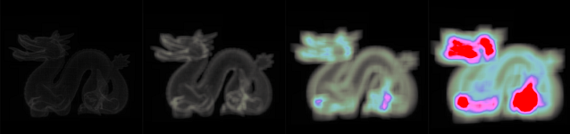](Descriptions/AccelConeTracing/AccelConeTracing.md)

### [Superjump - Trampoline Jumping with a Head-Mounted Display in Virtual Reality](Descriptions/Superjump/Superjump.md) ###

(VR, 3D-user-interaction, Framework)

[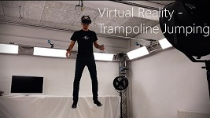](Descriptions/Superjump/Superjump.md)

### [Diminished Human - Empathizing Audiovisual Sense Impairments with Mixed Reality](Descriptions/DiminishedHuman/DiminishedHuman.md) ###

(Mixed Reality, Head-Mounted Display, Audio- and Image processing)

[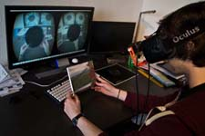](Descriptions/DiminishedHuman/DiminishedHuman.md)

### [Public Brewing - A Media Façade with a Mixed Reality Interface to brew beer](Descriptions/PublicBrewing/PublicBrewing.md) ###

(AR, Media Installation, Networking)

[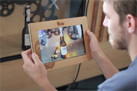](Descriptions/PublicBrewing/PublicBrewing.md)

### [Zero Gravity - A Virtual Reality experience in air and water](Descriptions/ZeroGravity/ZeroGravity.md) ###

(VR, Multimodal interaction)

[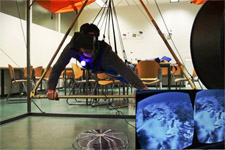](Descriptions/ZeroGravity/ZeroGravity.md)

### [Immersive 360° Videos - Virtual Reality Zoo Visit and Immersive Journalism](Descriptions/360Video/360Video.md) ###

(VR, HCI)

[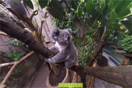](Descriptions/360Video/360Video.md)

### [Virtual Studio - Semi-Automatic Camera and Switcher Control](Descriptions/VirtualStudio/VirtualStudio.md) ###

(Audio processing, Expert system, Networking)

[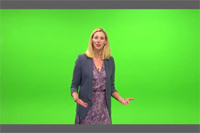](Descriptions/VirtualStudio/VirtualStudio.md)

### [Birds - An interactive, chirping media installation](Descriptions/Birds/Birds.md) ###

(Computer graphics, Media Installation, Agents)

[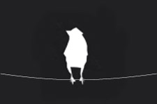](Descriptions/Birds/Birds.md)

### Others
#### Smartcity - Augmented Reality Visualization
* Programmed an Augmented Reality visualization for 1 month in a team of 4 for [Panasonic](https://www.panasonic.com). Coded on the user interaction and animation sequences.
* Project featured at the <a href="http://www.ifa-berlin.de/en/" target="_blank">IFA 2016 in Berlin</a> (world's leading trade show for consumer electronics and home appliances).

**Panasonic smartcity AR booth**

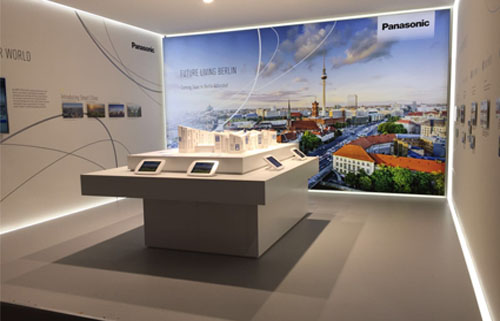

#### Augmented Reality photo album
My vision was to breathe life into my old photos. An Android app enables the user to see different animations or effects on the images, e.g. it is snowing on a winter image or you can see the people breathing. Content was hand-made. Used [Vuforia](https://www.vuforia.com/) for image tracking.

**Magic lens exposes my bad barbecue skills**

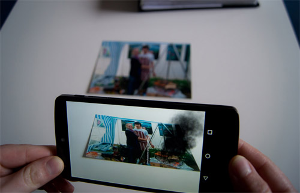

#### Augmented Reality Sound Sandbox: An artistic installation for musical expression
This installation produces ambient soundscapes using a Lattice Boltzmann based particle simulation running through a deformable landscape.
Our interface exploits the three-dimensional topology of physical sand, distributed over a tabletop surface. Visual feedback is front-projected onto the sand and onto the users
hand. The user can explore the landscape by using his or her hands and use spatial gestures via on-body projection to control AR content and further settings.

Although the project itself was a huge effort, it was mainly conducted by Bastian Dewitz as part of his master thesis. However,
I helped him out with prototyping interaction concepts, visuals, interaction design, camera to projection space calibration and an informal evaluation.

The project was published in <a href="https://link.springer.com/chapter/10.1007/978-3-319-73062-2_5" target="_blank">INTETAIN 2017: Intelligent Technologies for Interactive Entertainment</a>

**[Video: Augmented Reality Sound Sandbox](https://www.youtube.com/embed/H0eqN31qsjY)**

**Particles flowing over the sand**

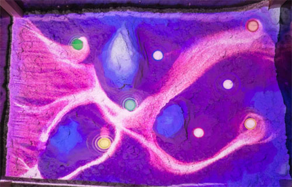

**Control menu projected on the user's hand**

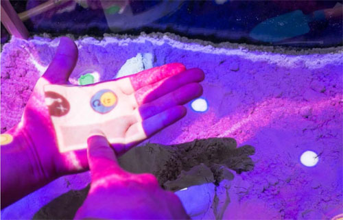

#### Lecture: Real-Time Rendering
The goal was to develop a shader and a corresponding ray tracing implementation. I implemented a grass geometry shader with billboards using Unity3D, ShaderLab/CG/HLSL and ray tracing program using <a href="https://developer.nvidia.com/optix">NVIDIA OptiX</a>. Compared both results in a short report.

**Grass billboard shader with animation in Unity3D**

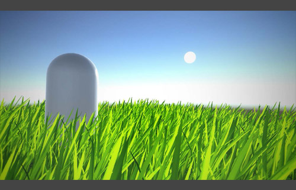

#### LeapMotion - Rock Paper Scissors - Proof of Concept
Coded small Proof of concept when the first version of [LeapMotion](https://www.leapmotion.com/) was released in 2013. This was done with a small JavaScript library provided by LeapMotion.

**[Video: LeapMotion - Rock Paper Scissors - Proof of Concept](https://www.youtube.com/embed/I8YFMh3L_GA)**

#### Java Robot programming - Race IT
We built and programmed a robot driving in a circuit with <a href="http://www.lejos.org/nxj.php" target="_blank">LeJOS, Java for Lego Mindstorms</a>. It had light, ultrasonic and RFID sensors to recognize the route, distances to obstacles and the type of obstacles it had to overcome. I programmed the ultrasonic sensor, the algorithm to drive over a seesaw, and our scanning and planning algorithm from scratch.

**[Video: Java Robot programming - Race IT](https://www.youtube.com/embed/H7a-Dd6fPmQ)**

#### Sudoku with Java
In our second semester, we implemented Sudoku on the command prompt with Java. The biggest challenge was to make the game easy to play via the command prompt. I coded the user interaction.

**[Video: Sudoku with Java](https://www.youtube.com/embed/S0vJuI4LfUM)**

			

#### Mini RPG-Game
Created for a friend using RPG-Maker 2k.

**Waking up in a foreign room, without any memories**

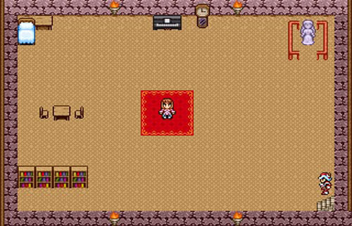

**Such a weird dream...**

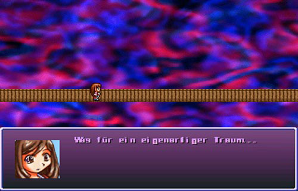

**Underworld: On the way to the demon king**

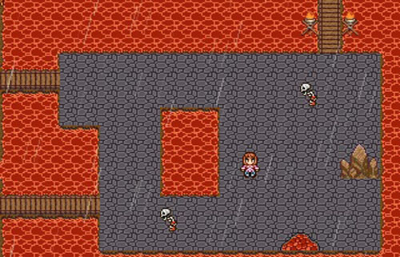

#### Blitzbasic Projects
Actually, [Blitzbasic](http://www.blitzbasic.de/) got me into programming at the age of around 10-13, I can't recall exactly. I started programming because I was a little gamer and I was always wondering how it is possible to create video games. However, this project was about practicing easy linear functions in the form f(x)=ax+b and one of my first programming projects ever. Some younger friends used this program to practice for their exams - needless to say they did well hehe.

**Practice linear functions with math text problems, calculation of intersection points, amongst other things**

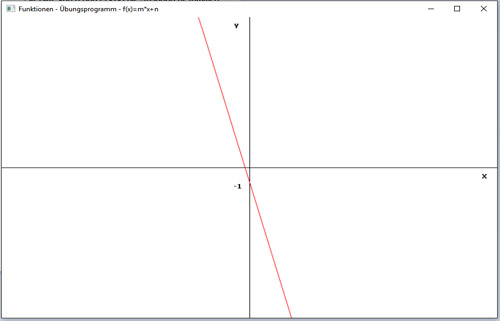

#### Autodesk Maya shorts
We created two short movies with [Maya](https://www.autodesk.com/products/maya/overview):
<ol>
	<li>The goal of the first one was to capture the atmosphere of a graveyard scenery (the assets in this short movie were bought)</li>
	<li>The goal of the second one was to show an abstract chain reaction between multiple objects (hand-made)</li>
</ol>

**[Video: Maya Graveyard scene](https://www.youtube.com/embed/j-n6WaSx484)**

**[Video: Maya Chain reaction short](https://www.youtube.com/embed/hgzCMNz6FXc)**

#### Others
(will add them when I'm finding the footage and also time for it)
* Android Quiz App programmed with <a href="https://www.ludei.com/cocoonjs/" target="_blank">CocoonJS</a>
* Web pong (HTML, CSS, JS)
* UnrealTournament maps I created (UnrealEditor)

[**Back to the top**](#portfolio)
