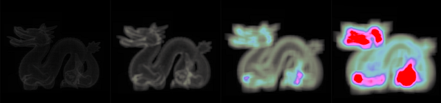
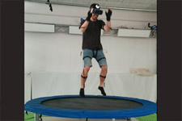
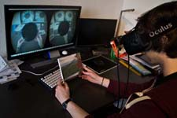
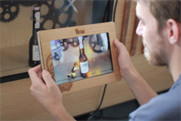
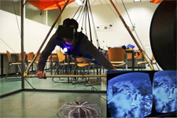
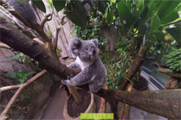
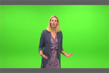
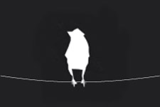
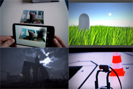

# Portfolio
## Scientific Publications
* <a href="https://link.springer.com/chapter/10.1007%2F978-3-319-73062-2_8" target="_blank">Trampoline Jumping with a Head-Mounted Display in Virtual Reality Entertainment</a>
* <a href="https://link.springer.com/chapter/10.1007/978-3-319-73062-2_5" target="_blank">AR Sound Sandbox: A Playful Interface for Musical and Artistic Expression</a>
* <a href="https://dl.acm.org/citation.cfm?id=2933559" target="_blank">Semi-Automatic Camera and Switcher Control for Live Broadcast</a>
* <a href="https://dl.acm.org/citation.cfm?id=2875226" target="_blank">Empathizing Audiovisual Sense Impairments: Interactive Real-Time Illustration of Diminished Sense Perception</a>
* <a href="https://dl.acm.org/citation.cfm?id=2757736" target="_blank">Public Brewing: a Media Façade with a Mixed Reality Interface</a>
* <a href="https://dl.gi.de/handle/20.500.12116/8203" target="_blank">ZeroGravity - eine virtuelle Nutzererfahrung in Luft und Wasser</a>
## Medium articles
* <a href="https://medium.com/@bromanz/simd-sse-unity3d-net-2-0-70f6c911713f" target="_blank">Utilizing SIMD/SSE in Unity3D (.NET 2.0)</a>
## Project pages
**Acceleration Structures for Cone Tracing**

**[Superjump - Trampoline Jumping with a Head-Mounted Display in Virtual Reality](Superjump/Superjump.md)**

**[Diminished Human - Empathizing Audiovisual Sense Impairments with Mixed Reality](DiminishedHuman/DiminishedHuman.md)**

**[Public Brewing - A Media Façade with a Mixed Reality Interface to brew beer](PublicBrewing/PublicBrewing.md)**

**Zero Gravity - A Virtual Reality experience in air and water**

**Immersive 360° Videos - Virtual Reality Zoo Visit and Immersive Journalism**

**Virtual Studio - Semi-Automatic Camera and Switcher Control**

**Birds - An interactive, chirping media installation**

**Others**

