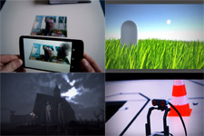

# Portfolio
I created this repository to collect and summarize many of my finished projects. It mainly includes projects I did during my studies or in my free-time (work experience mostly not included, as they require privacy from the companies I've been working for so far). Besides the projects listed here, I also have some public repositories on my GitHub account (mainly experiments, contributions, or work in progress though), but feel free to check them out too if you're interested. Below you will find four categories:
1. [**Papers**](#papers) - Here I put all the links to my published scientific papers and articles 
2. [**Tech blog posts**](#tech-blog-articles) - From time to time I try to share some collected knowledge about a topic or explain some ideas I had. 
3. [**Talks**](#talks) - Official public talks I've given. 
4. [**Project pages**](#project-pages) - These link to more specific project information including a summary, achievements, my responsibilities in these projects, etc.

## Papers
* <a href="https://link.springer.com/chapter/10.1007%2F978-3-319-73062-2_8" target="_blank">Trampoline Jumping with a Head-Mounted Display in Virtual Reality Entertainment</a>
* <a href="https://link.springer.com/chapter/10.1007/978-3-319-73062-2_5" target="_blank">AR Sound Sandbox: A Playful Interface for Musical and Artistic Expression</a>
* <a href="https://dl.acm.org/citation.cfm?id=2933559" target="_blank">Semi-Automatic Camera and Switcher Control for Live Broadcast</a> ; <a href="https://www.fktg.org/halbautomatische-steuerung-von-kamera-und-bildmischer-bei-live-uebertragungen" target="_blank">Halbautomatische Steuerung von Kamera und Bildmischer bei Live-Übertragungen</a>
* <a href="https://dl.acm.org/citation.cfm?id=2875226" target="_blank">Empathizing Audiovisual Sense Impairments: Interactive Real-Time Illustration of Diminished Sense Perception</a>
* <a href="https://dl.acm.org/citation.cfm?id=2757736" target="_blank">Public Brewing: a Media Façade with a Mixed Reality Interface</a>
* <a href="https://dl.gi.de/handle/20.500.12116/8203" target="_blank">ZeroGravity - eine virtuelle Nutzererfahrung in Luft und Wasser</a>
## Tech blog articles
* <a href="https://medium.com/@bromanz/another-view-on-the-classic-ray-aabb-intersection-algorithm-for-bvh-traversal-41125138b525" target="_blank">Another View on the Classic Ray-AABB Intersection Algorithm for BVH Traversal</a>
* <a href="https://medium.com/@bromanz/how-to-create-awesome-accelerators-the-surface-area-heuristic-e14b5dec6160" target="_blank">How to create awesome accelerators: The Surface Area Heuristic</a>
* <a href="https://medium.com/@bromanz/simd-sse-unity3d-net-2-0-70f6c911713f" target="_blank">Utilizing SIMD/SSE in Unity3D (.NET 2.0)</a>
## Talks
* <a href="https://unite.unity.com/de/2018/berlin/autotech" target="_blank">Unite Berlin 2018 - Closing the Loop: Unity as a Tool for Vehicle Development</a>
## Project pages
### [Acceleration Structures for Cone Tracing](Descriptions/AccelConeTracing/AccelConeTracing.md) ###

(Computer Graphics, Ray Tracing, kd-tree, Bounding Volume Hierarchies)

### [Superjump - Trampoline Jumping with a Head-Mounted Display in Virtual Reality](Descriptions/Superjump/Superjump.md) ###

(VR, 3D-user-interaction, Framework)

### [Diminished Human - Empathizing Audiovisual Sense Impairments with Mixed Reality](Descriptions/DiminishedHuman/DiminishedHuman.md) ###

(Mixed Reality, Head-Mounted Display, Audio- and Image processing)

### [Public Brewing - A Media Façade with a Mixed Reality Interface to brew beer](Descriptions/PublicBrewing/PublicBrewing.md) ###

(AR, Media Installation, Networking)

### [Zero Gravity - A Virtual Reality experience in air and water](Descriptions/ZeroGravity/ZeroGravity.md) ###

(VR, Multimodal interaction)

### [Immersive 360° Videos - Virtual Reality Zoo Visit and Immersive Journalism](Descriptions/360Video/360Video.md) ###

(VR, HCI)

### [Virtual Studio - Semi-Automatic Camera and Switcher Control](Descriptions/VirtualStudio/VirtualStudio.md) ###

(Audio processing, Expert system, Networking)

### [Birds - An interactive, chirping media installation](Descriptions/Birds/Birds.md) ###

(Computer graphics, Media Installation, Agents)

### [Others](Descriptions/Others/Others.md) ###

(Media Installations, Apps, Games, Robots, Prototypes, Reports)

[**Back to the top**](#portfolio)
