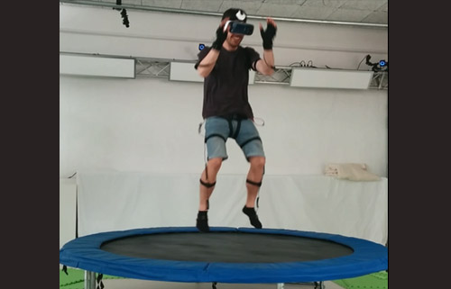
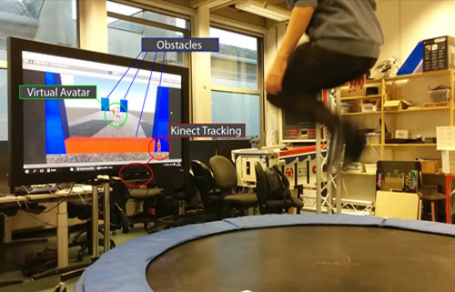
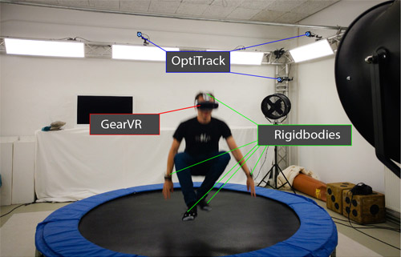
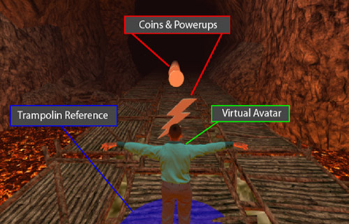

# Superjump - Trampoline Jumping with a Head-Mounted Display in Virtual Reality
## Summary
Using a trampoline as a natural 3D user interface with a Head- Mounted Display for virtual reality is a novel and challenging task. High latencies between interaction and feedback or inaccurate tracking of the user’s movement can lead to simulator sickness. Within the scope of this project, we researched the most appropriate solutions for the described challenge by testing multiple tracking and virtual reality technologies. A fast and precise network-based system was developed using OptiTrack as an infrared based marker tracking solution and Samsung GearVR as a wireless Head-Mounted Display. The introduced system offers an interface to control an application with a trampoline. For instance, it provides methods to request the average jump duration or the user’s current jump height. In addition, it handles interactions or changes the virtual jump height mapping. Two prototypes were developed, examplarily implementing the interface in gaming experiences. We chose one of them to test it with the Simulator Sickness Questionnaire. This evaluation revealed that our system enables a safe and fascinating jumping experience. Although users were visually completely immersed into the virtual world by the Head-Mounted Display, most of them did not report specific simulator sickness related to the fast jumping motions on the trampoline.

This project was presented at an in-house exhibition with approx. 300 participants. Furthermore, it was published at [INTETAIN 2017](https://link.springer.com/chapter/10.1007%2F978-3-319-73062-2_8).

## Media
Video: Superjump - Behind the scenes

Teammate experiencing jumping with the GearVR and Perception Neuron Tracking

Prototype with Kinect and a screen

Final setup: OptiTrack and GearVR

EndlessRunner: Virtual avatar controlled with Inverse Kinematics

##Further information
* [INTETAIN 2017](https://link.springer.com/chapter/10.1007%2F978-3-319-73062-2_8)
