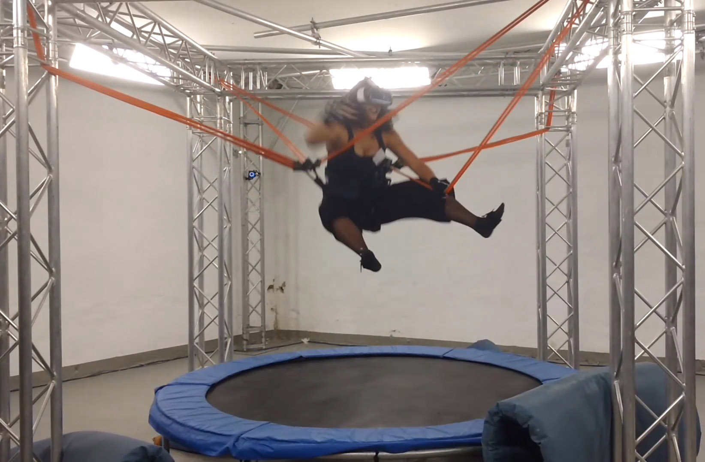

# Superjump - Trampoline Jumping with a Head-Mounted Display in Virtual Reality
## Summary
Using a trampoline as a natural 3D user interface with a Head- Mounted Display for virtual reality is a novel and challenging task. High latencies between interaction and feedback or inaccurate tracking of the user’s movement can lead to simulator sickness. Within the scope of this project, we researched the most appropriate solutions for the described challenge by testing multiple tracking and virtual reality technologies. A fast and precise network-based system was developed using OptiTrack as an infrared based marker tracking solution and Samsung GearVR as a wireless Head-Mounted Display. The introduced system offers an interface to control an application with a trampoline. For instance, it provides methods to request the average jump duration or the user’s current jump height. In addition, it handles interactions or changes the virtual jump height mapping. Two prototypes were developed, examplarily implementing the interface in gaming experiences. We chose one of them to test it with the Simulator Sickness Questionnaire.

## Achievements
* Evaluation revealed that our system enables a safe and fascinating jumping experience.
* Users were visually completely immersed into the virtual world by the Head-Mounted Display. Still, most of them did not report specific simulator sickness related to the fast jumping motions on the trampoline.
* Project was first presented at an in-house exhibition with approx. 300 participants and has since been shown at many other public events. 
* To this day, other student groups in the university regularly use our framework to create engaging VR trampoline experiences.
* Furthermore, the project was published at [INTETAIN 2017: Intelligent Technologies for Interactive Entertainment](https://link.springer.com/chapter/10.1007%2F978-3-319-73062-2_8). 

## My responsibilities
* Designed and implemented the whole framework to easily create trampoline jumping games with this setup, including (but non-exclusive):
  * OptiTrack tracking, 
  * Avatar visualization and control (none, IK driven, static, ...),
  * Interfaces to interesting parameters for developers (virtual jump height mapping, average jump duration, current jump height, interaction gestures, forces, velocities, etc.)

## Media
**[Video: Superjump - Behind the scenes](https://www.youtube.com/embed/KEtzEuRBNKI)**

**Teammate experiencing jumping with the GearVR and Perception Neuron Tracking**

**Prototype with Kinect and a screen**

**Final setup: OptiTrack and GearVR**

**EndlessRunner: Virtual avatar controlled with Inverse Kinematics**

**[Video: Spacejump VR](https://player.vimeo.com/video/200660727?color=ffff00&title=0&byline=0&portrait=0)**

